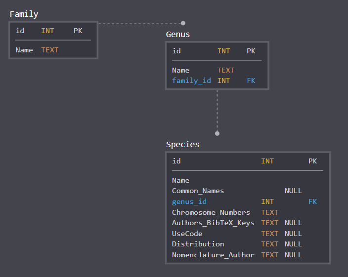

# ChromosomeAtlas
Chromosome Atlas of Nepal -- Database and Book

# Python scripts to compile book
## 2020-Nov-23
- Working on reviving scripts and testing

# Meeting Notes
## 2018-Sep-19

- sent github invites
- Projects (1) BibTeX drafts, (2) Review, (3) Database Schema
- Created MySQL project in SQLdbm (completed first version of Schema)
- Explained the project high-level to Suraj
- Created Google Sheets for Acanthaceae and Aceraceae

# Schema

